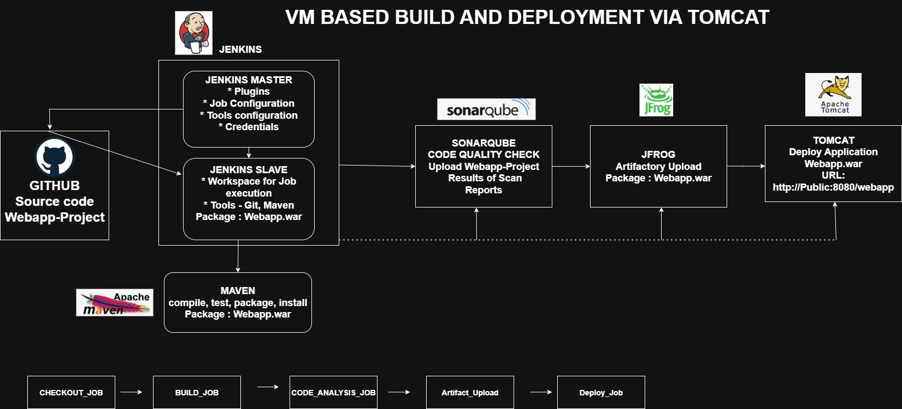

# VM-based Build and Deploy Pipeline via Jenkins and Tomcat

## Project Overview
This project demonstrates an automated build and deployment pipeline for Java web applications using Jenkins integrated with GitHub, Maven, SonarQube, JFrog Artifactory, and Tomcat. The setup uses multiple VMs with Jenkins master-slave architecture to streamline the continuous integration and delivery process.

## Architecture & Machine Setup
- **Machine 1:** Jenkins Master (t2.medium, 2 vCPU, 4 GB RAM)
  - Java 21, Jenkins package, Git
- **Machine 2:** Jenkins Slave (t2.medium, 2 vCPU, 4 GB RAM)
  - Java 21, Maven, Git, Slave integration with Jenkins
- **Machine 3:** SonarQube & Tomcat (t2.medium, 2 vCPU, 4 GB RAM)
  - Java 21, SonarQube server, Tomcat server
- **Machine 4:** JFrog Artifactory (t2.medium, 2 vCPU, 4 GB RAM)
  - Java 21, JFrog Artifactory

## Key Integrations
- **GitHub:** Integrated for source code versioning and checkout via Jenkins.
- **Maven:** Configured in Jenkins slave for building Java applications.
- **SonarQube:** Used for static code analysis to maintain code quality.
- **JFrog Artifactory:** Acts as an artifact repository to store build artifacts.
- **Tomcat:** Deployment server for hosting Java web applications.



## Jenkins Pipeline Implementation
- Used both Jenkins Freestyle projects and Pipelines (Declarative and Scripted).
- Blue Ocean plugin used for enhanced pipeline visualization.
- The pipeline includes stages for:
  - Pre-build steps triggered by GitHub webhook.
  - Source code checkout from GitHub.
  - Maven build and unit testing.
  - SonarQube static code analysis.
  - Artifact upload to JFrog Artifactory.
  - Deployment of WAR files to Tomcat server.
  - Post-build success message.

## Jenkinsfile Sample
```
pipeline {
    agent { node { label 'slave_1' } }
    tools {
        maven 'MAVEN_HOME'
        jdk 'JAVA_HOME'
    }
    stages {
        stage('Pre-build') {
            steps {
                sh 'echo "Starting build triggered by GitHub webhook"'
            }
        }
        stage('Git Checkout') {
            steps {
                checkout([$class: 'GitSCM', branches: [[name: '*/master']], userRemoteConfigs: [[credentialsId: 'github access', url: 'https://github.com/GoudSagar/Hello-World-Code.git']]])
            }
        }
        stage('Build') {
            steps {
                sh 'mvn package'
            }
        }
        stage('Unit Test') {
            steps {
                sh 'mvn test'
            }
        }
        stage('Static Code Analysis') {
            environment {
                scannerHome = tool 'SONAR_SCANNER'
            }
            steps {
                withSonarQubeEnv('SONAR_HOME') {
                    sh "${scannerHome}/bin/sonar-scanner"
                }
            }
        }
        stage('Artifact Upload') {
            steps {
                rtUpload(
                    serverId: 'artifactory',
                    spec: '''{
                        "files": [{"pattern": "*.war","target": "local-snapshots"}]
                    }'''
                )
            }
        }
        stage('Tomcat Deployment') {
            steps {
                script {
                    deploy adapters: [tomcat7(credentialsId: 'tomcat-credentials', path: '', url: 'http://52.15.212.198:8080')], contextPath: '/webapp-app', onFailure: false, war: 'webapp/target/webapp.war'
                }
            }
        }
        stage('Post-build') {
            steps {
                sh 'echo "Successful pipeline execution and deployment."'
            }
        }
    }
}
```


## Benefits and Notes
- Utilizes Jenkins pipeline as code with version control in GitHub.
- Enables automated, repeatable builds and deployments hosted on VM infrastructure.
- Supports quality gate checks with SonarQube to catch code issues early.
- Artifacts are securely managed and stored using JFrog Artifactory.
- Deployment process is automated to reduce manual errors and speed up releases.
- Free style jobs chained for ease before fully transitioning to pipeline scripts with Blue Ocean UI.
